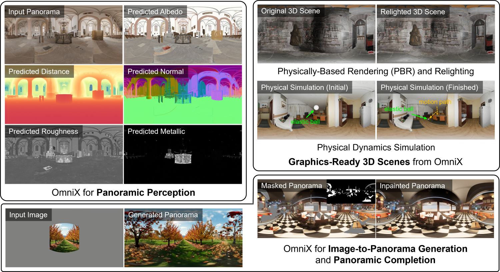

<h1 align="center">OmniX: From Unified Panoramic Generation and Perception to Graphics-Ready 3D Scenes</h1>

<div align="center">

[](https://yukun-huang.github.io/OmniX/)
[](https://arxiv.org/abs/xxxx.xxxxx)
[](https://huggingface.co/KevinHuang/OmniX)
[](https://huggingface.co/datasets/KevinHuang/PanoX)
[]()

</div>

<p align="left">

<br>
A family of panoramic flow matching models that achieves panorama generation, perception, and completion.
</p>

<!-- ## 📢 News
- [2025-10-16] Released. -->

## 📝 TODO

- [x] Release inference code for panorama generation and perception.
- [ ] Release inference code for graphics-ready 3D scene generation.
- [ ] Release inference code for panorama completion.
- [ ] Release PanoX dataset.
- [ ] Release training code.

## ⚙️ Installation
Please follow the instructions below to get the code and install dependencies.

Clone the repo:
```bash
git clone https://github.com/HKU-MMLab/OmniX.git
cd OmniX
```

Create a conda environment (optional):
```
conda create -n omnix python=3.11
conda activate omnix
```

Install dependencies:
```
pip install -r requirements.txt
```

## 🚀 Inference

### Panorama Generation
```bash
# Generation from Text
python run_generation.py --prompt "Photorealistic modern living room" --output_dir "outputs/generation_from_text"

# Generation from Image and Text
python run_generation.py --image "assets/examples/image.png" --prompt "Photorealistic modern living room" --output_dir "outputs/generation_from_image_and_text"
```

### Panorama Perception
```bash
# Multi-Property Perception (Depth, Normal, Albedo, Roughness, Metallic, Semantic) from Panorama
python run_perception.py --panorama "assets/examples/panorama.png" --output_dir "outputs/perception"
```

### Panorama Generation and Perception
```bash
# Generation and Perception from Text
python run_all.py --prompt "Photorealistic modern living room" --output_dir "outputs/generation_and_perception_from_text"

# Generation and Perception from Image and Text
python run_all.py --image "assets/examples/image.png" --prompt "Photorealistic modern living room" --output_dir "outputs/generation_and_perception_from_image_and_text"
```

## 👏 Acknowledgement
This repository is based on many amazing research works and open-source projects: [PanFusion](https://github.com/chengzhag/PanFusion), [diffusers](https://github.com/huggingface/diffusers), [equilib](https://github.com/haruishi43/equilib), etc. Thanks all the authors for their selfless contributions to the community!

## 😉 Citation
If you find this repository helpful for your work, please consider citing it as follows:
```bib
@article{huang2025omnix,
    title={OmniX: From Unified Panoramic Generation and Perception to Graphics-Ready 3D Scenes},
    author={},
    journal={arXiv preprint arXiv:xxxx.xxxxx},
    year={2025}
}
```
