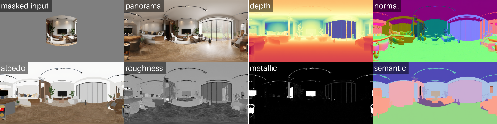

<h1 align="center">OmniX: From Unified Panoramic Generation and Perception to Graphics-Ready 3D Scenes</h1>

<div align="center">

[](https://yukun-huang.github.io/OmniX/)
[](https://arxiv.org/abs/2510.26800)
[](https://huggingface.co/KevinHuang/OmniX)
[](https://huggingface.co/datasets/KevinHuang/PanoX)
<!-- []() -->

</div>

<p align="left">

<br>
We introduce <b>OmniX</b>, a family of flow matching generative models that achieves <b>unified panorama perception, generation, and completion</b>. Using OmniX as a world generator, we can create graphics-ready 3D scenes ready for physically based rendering, relighting, and simualtion.
</p>

<!-- ## 📢 News
- [2025-10-16] Released. -->

## 📝 TODO

- [x] Release inference code for panorama generation and perception.
- [x] Release inference code for graphics-ready 3D scene generation (beta).
- [ ] Release inference code for panorama completion.
- [ ] Release PanoX dataset.
- [ ] Release training code.

## ⚙️ Installation
Please follow the instructions below to get the code and install dependencies.

### Clone the repo:
```bash
git clone https://github.com/HKU-MMLab/OmniX.git
cd OmniX
```

### Create a conda environment:
```
conda create -n omnix python=3.11
conda activate omnix
```

### Install dependencies:
```
pip install -r requirements.txt
```

### Install Blender (optional, for exporting 3D scenes only):
Please refer to the [official installation guide](https://www.blender.org/download/) to install Blender on your PC or remote server. We use Blender 4.4.3 for Linux.

Alternatively, you may use:
```
pip install bpy
```
to use the Blender Python API without installing the full Blender, but we haven't tested this carefully.

## 🚀 Inference

### Panorama Generation
OmniX can generate high-quality panoramic images from image or text prompts:
```bash
# Generation from Text
python run_pano_generation.py --prompt "Photorealistic modern living room" --output_dir "outputs/generation_from_text"

# Generation from Image and Text
python run_pano_generation.py --image "assets/examples/image.png" --prompt "Photorealistic modern living room" --output_dir "outputs/generation_from_image_and_text"
```


### Panorama Perception
Given an RGB panorama as input, OmniX can predict geometric, intrinsic, and semantic properties:

```bash
# Perception (Distance, Normal, Albedo, Roughness, Metallic, Semantic) from Panorama
python run_pano_perception.py --panorama "assets/examples/panorama.png" --output_dir "outputs/perception_from_panorama"
```


### Panorama Generation and Perception
Naturally, we can combine panorama generation and perception to obtain a panoramic image with multiple property annotations:

```bash
# Generation and Perception from Text
python run_pano_all.py --prompt "Photorealistic modern living room" --output_dir "outputs/generation_and_perception_from_text"

# Generation and Perception from Image and Text
python run_pano_all.py --image "assets/examples/image.png" --prompt "Photorealistic modern living room" --output_dir "outputs/generation_and_perception_from_image_and_text"
```



### Graphics-Ready Scene Generation (Beta)
Note that the code for graphics-ready scene reconstruction/generation is not ready and is still in progress.

```bash
# Generation from Text
python run_scene_generation.py --prompt "Photorealistic modern living room" --output_dir "outputs/construction_from_text"
# Generation from Text (Fast)
python run_scene_generation.py --prompt "Photorealistic modern living room" --output_dir "outputs/construction_fast_from_text" --rgb_as_albedo --disable_normal --use_default_pbr --fill_invalid_depth

# Generation from Image and Text
python run_scene_generation.py --image "assets/examples/image.png" --prompt "Photorealistic modern living room" --output_dir "outputs/construction_from_image_and_text"
# Generation from Image and Text (Fast)
python run_scene_generation.py --image "assets/examples/image.png" --prompt "Photorealistic modern living room" --output_dir "outputs/construction_fast_from_image_and_text" --rgb_as_albedo --disable_normal --use_default_pbr --fill_invalid_depth

# Generation from Panorama
python run_scene_generation.py --panorama "assets/examples/panorama.png" --output_dir "outputs/construction_from_panorama"
# Generation from Panorama (Fast)
python run_scene_generation.py --panorama "assets/examples/panorama.png" --output_dir "outputs/construction_fast_from_panorama" --rgb_as_albedo --disable_normal --use_default_pbr --fill_invalid_depth
```


## 👏 Acknowledgement
This repository is based on many amazing research works and open-source projects: [PanFusion](https://github.com/chengzhag/PanFusion), [DreamCube](https://github.com/Yukun-Huang/DreamCube), [WorldGen](https://github.com/ZiYang-xie/WorldGen), [diffusers](https://github.com/huggingface/diffusers), [equilib](https://github.com/haruishi43/equilib), etc. Thanks all the authors for their selfless contributions to the community!

## 😉 Citation
If you find this repository helpful for your work, please consider citing it as follows:
```bib
@article{omnix,
    title={OmniX: From Unified Panoramic Generation and Perception to Graphics-Ready 3D Scenes},
    author={Huang, Yukun and Yu, Jiwen and Zhou, Yanning and Wang, Jianan and Wang, Xintao and Wan, Pengfei and Liu, Xihui},
    journal={arXiv preprint arXiv:2510.26800},
    year={2025}
}
```
